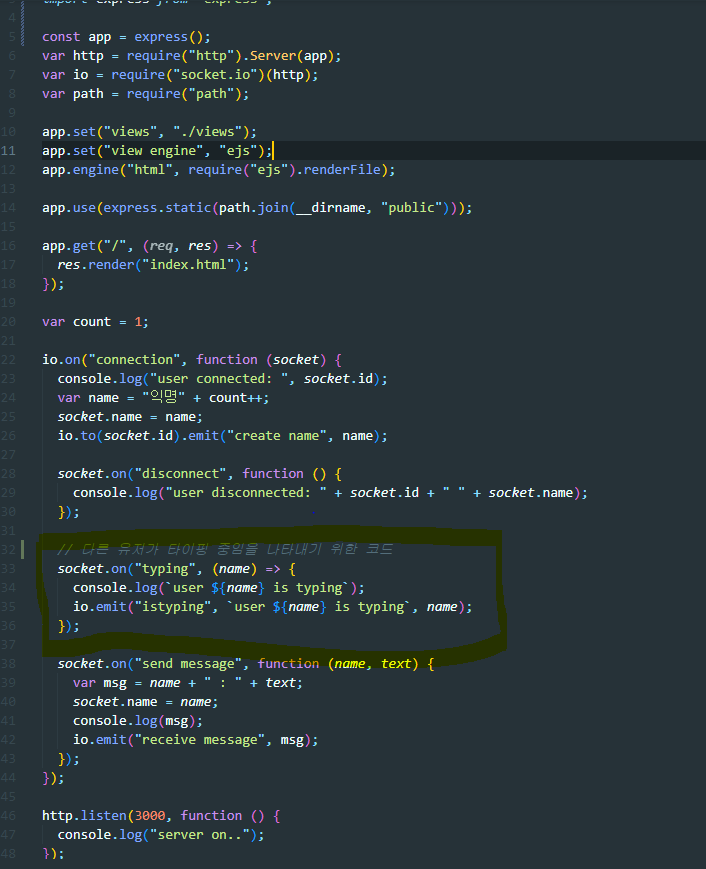
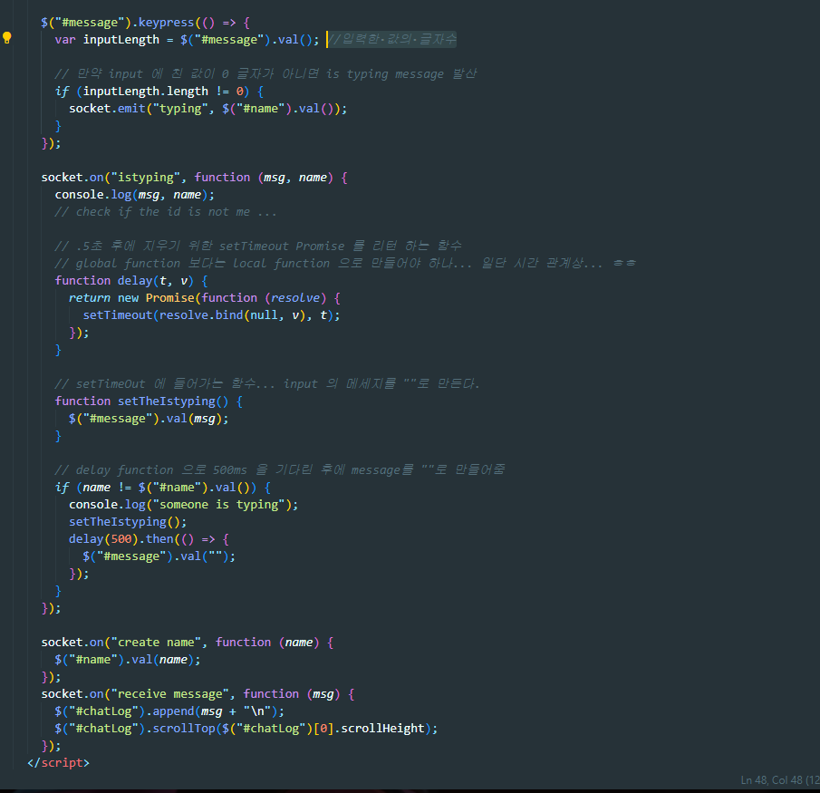
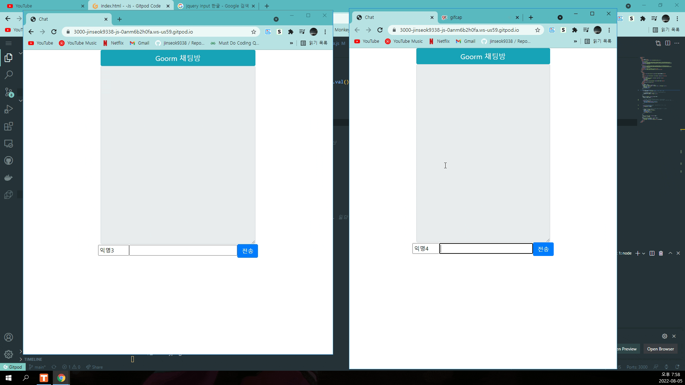

# 웹 개발 트랙 - JS (고급) 2주차

Express.js 와 Socket io 를 이용하여 간단한 챗 기능 구현

기본적인 챗 기능은 강의에 구현 되어 있다. 그래서 상대방이 치고 있는지 아닌지 확인 하는 기능을 추가 하였다.

2. express-generator 가 아닌 npm init 부터 시작하여 프로젝트 생성
3. Jade 가 아닌 html 을 템플렛으로 사용
4. Promise 를 이용한 비동기 기능 추가. -- 물론 버그도 존재하지만 일단 구현에 의미를 두자

---

index.js

index.html

결과

