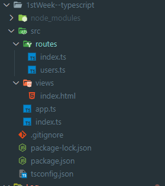
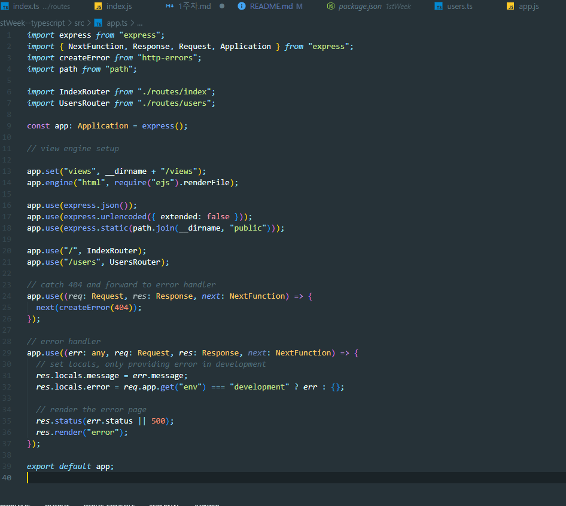

# 웹 개발 트랙 - JS (고급) 1주차

Express.js 를 이용하여 간단한 서버와 url 에 따라서 다른 페이지로 라우팅 하는것을 실습하였다

문제점.

1. Npm 으로 express-generator 를 깔아보니 express-generator 에 치명적인 취약점이 발견 되었다.
2. typescrtipt 를 사용하여 협업성과 나중에 디버깅을 할때 용이하게 만들고 싶었다.
3. Jade 를 템플릿으로 쓰는것보다 json 객체나 html 을 쓰는것이 더 유용하다고 생각하였다.
4. morgan, 과 jade 패키지에 취약점이 발견되었음

그래서 1stWeek --typecript 에 문제의 예시를 typescript 로 변형 하여 다시 만들어 보았다

1. typescrtipt를 이용하여 type system 을 넣어줌
2. express-generator 가 아닌 npm init 부터 시작하여 프로젝트 생성
3. Jade 가 아닌 html 을 템플렛으로 사용
4. nodemon 을 활용한 핫리로딩

---

폴더 구성

---

app.ts

